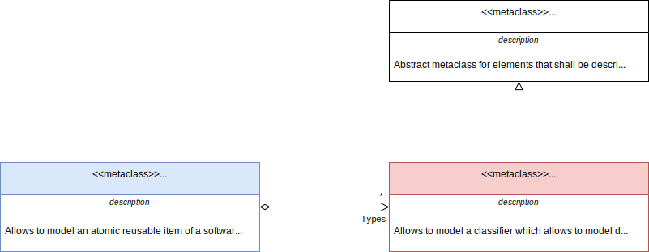
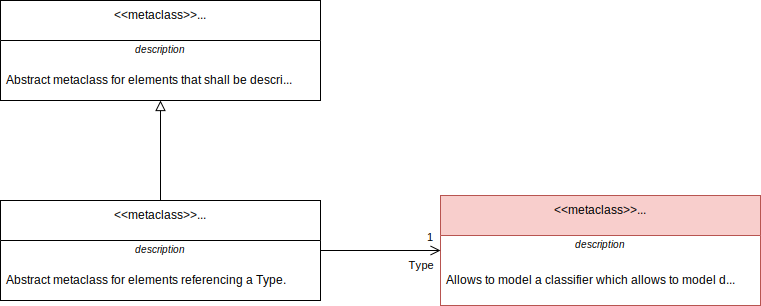

# Embedded_Software_Metamodel

This repository defines a metamodel allowing to model an embedded software
loaded on a microcontroller.  
The metamodel is framework and language independent.  
It is a set of metaclasses, relations and constraints dedicated to the modeling
of an embedded software.

This metamodel is intented to cover the embedded software design from the
functional architecture to the detailed design.  
Currently only the static elements of the physical software architecture are
covered.

## Software_Element

The _Identifier_ attribute is by definition unique. Only the elements that have
an _Identifier_ can be compared to one of their other version.

## Package

## Project

## Types

### Typed_Element

### Basic_Type

### Array_Type

### Enumerated_Type

### Fixed_Point_Type

### Record_Type

## Interface

### Client_Server_Interface

### Event_Interface

## Component_Type

### Port

### Configuration_Parameter

### OS_Operation

## Composition

### Component_Prototype

### Connector

### Task

